import { Card, Cards } from 'nextra/components'

{<h1 className="mt-10 mb-4 text-center text-[2.5rem] font-bold tracking-tight">Партнеры</h1>}

{
компании, сотрудничающие с нами
}

<Cards>
  <ShowcaseCard
    title="GraphQL Yoga"
    href="https://1pnk.ru"
  >
    <>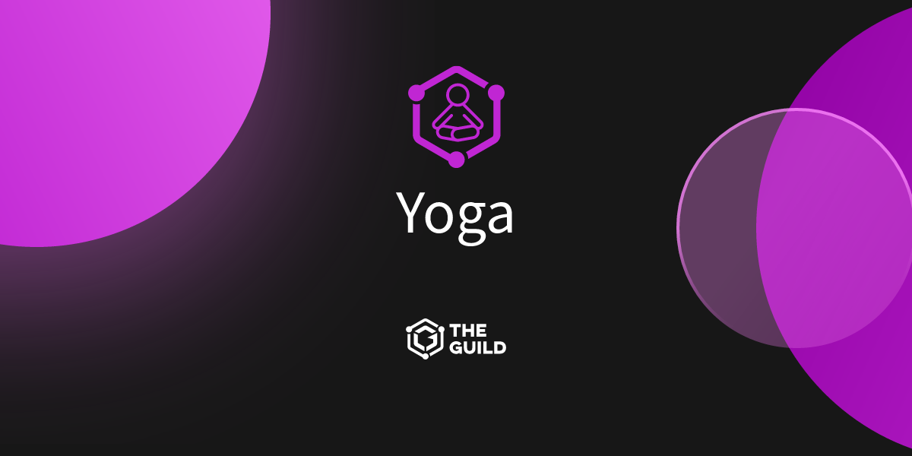</>
  </ShowcaseCard>
  <ShowcaseCard
    title="GraphQL Envelop"
    href="https://1pnk.ru"
  >
    <>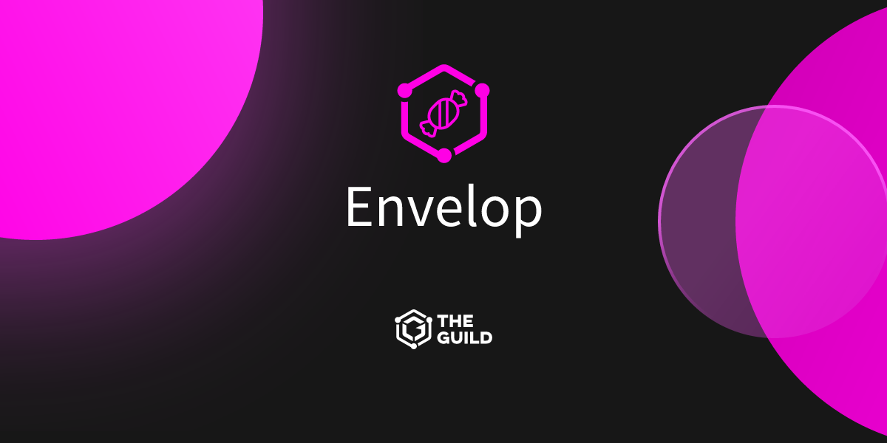</>
  </ShowcaseCard>
  <ShowcaseCard
    title="GraphQL Inspector"
    href="https://1pnk.ru"
  >
    <>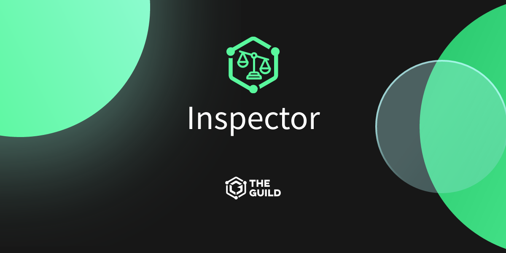</>
  </ShowcaseCard>
  <ShowcaseCard
    title="GraphQL Code Generator"
    href="https://1pnk.ru"
  >
    <>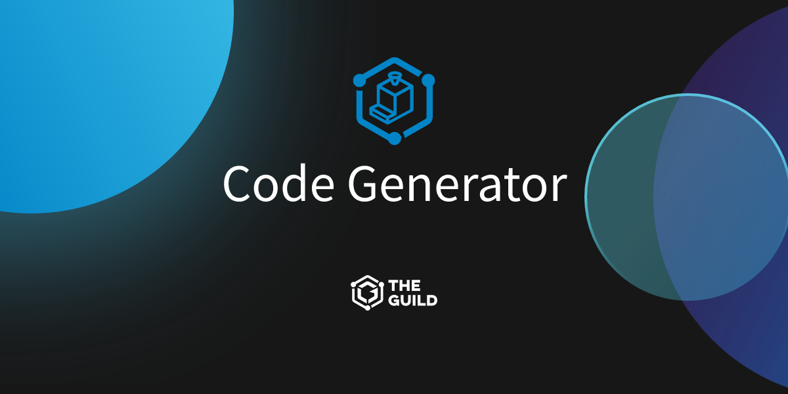</>
  </ShowcaseCard>
  <ShowcaseCard title="GraphQL Mesh" href="https://1pnk.ru">
    <>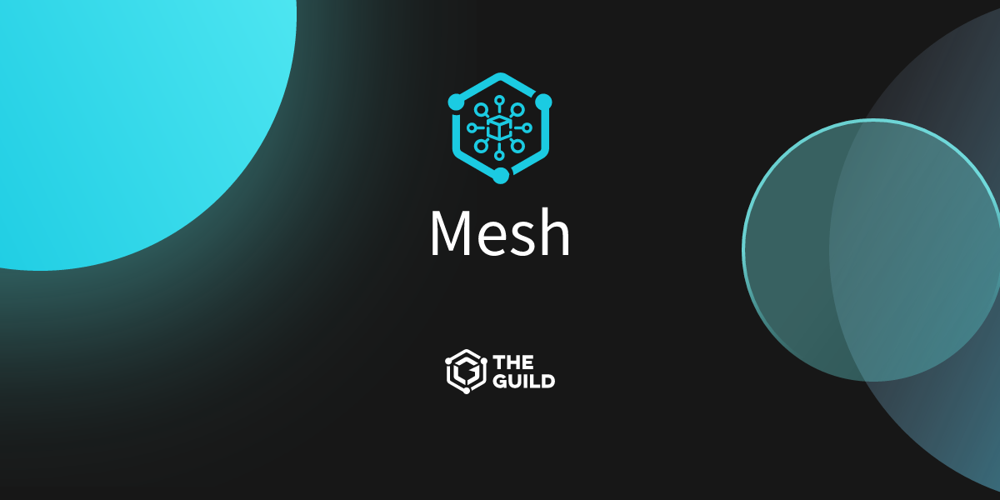</>
  </ShowcaseCard>
  <ShowcaseCard
    title="GraphQL Tools"
    href="https://1pnk.ru"
  >
    <>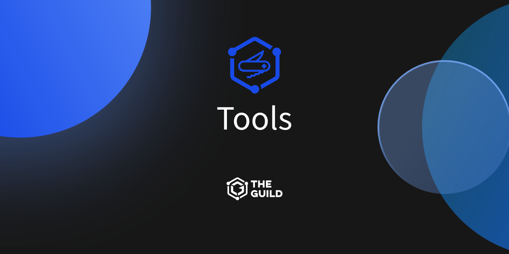</>
  </ShowcaseCard>
  <ShowcaseCard
    title="GraphQL Modules"
    href="https://1pnk.ru"
  >
    <>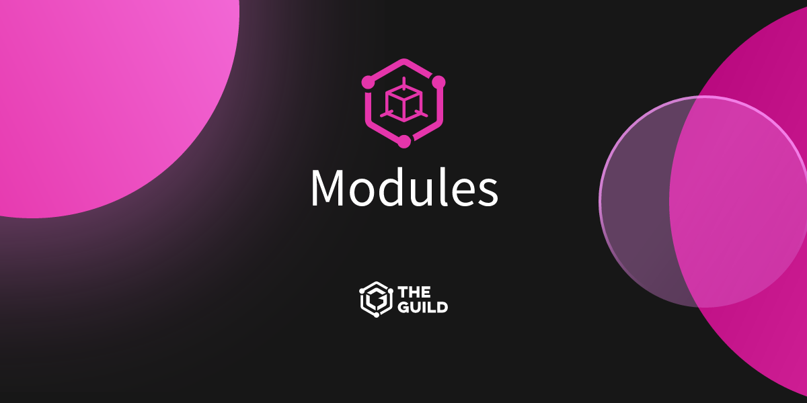</>
  </ShowcaseCard>
  <ShowcaseCard
    title="GraphQL ESLint"
    href="https://1pnk.ru"
  >
    <>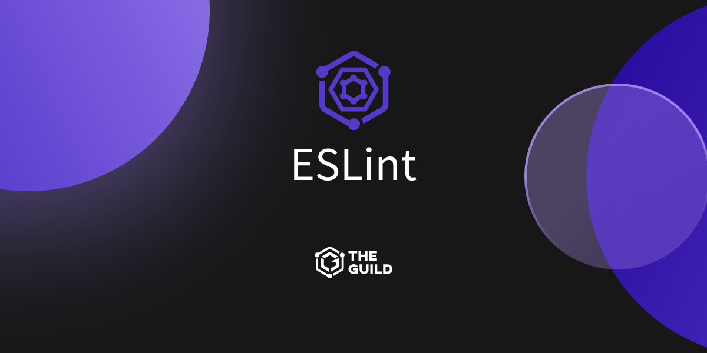</>
  </ShowcaseCard>
  <ShowcaseCard
    title="GraphQL Config"
    href="https://1pnk.ru"
  >
    <></>
  </ShowcaseCard>
  <ShowcaseCard
    title="GraphQL Scalars"
    href="https://1pnk.ru"
  >
    <>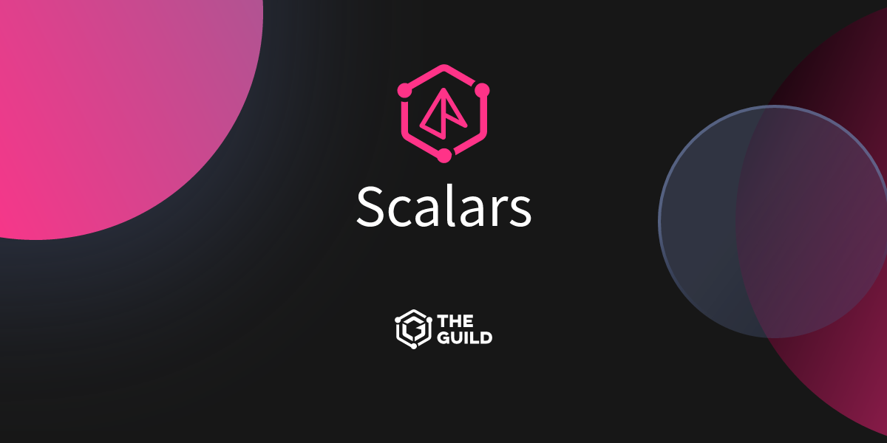</>
  </ShowcaseCard>
  <ShowcaseCard
    title="GraphQL Shield"
    href="https://1pnk.ru"
  >
    <>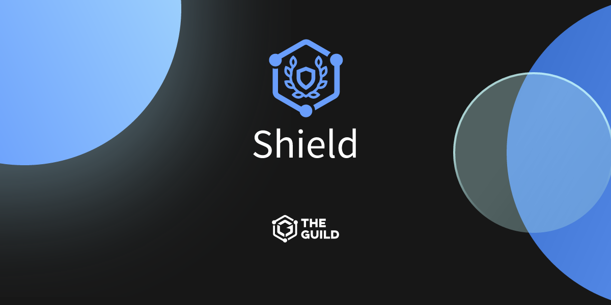</>
  </ShowcaseCard>
  <ShowcaseCard
    title="GraphQL SOFA"
    href="https://1pnk.ru"
  >
    <>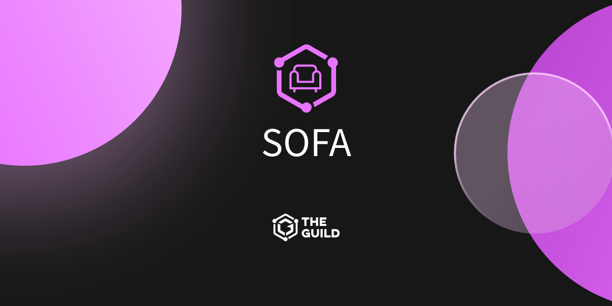</>
  </ShowcaseCard>
  <ShowcaseCard
    title="Apollo Angular"
    href="https://1pnk.ru"
  >
    <>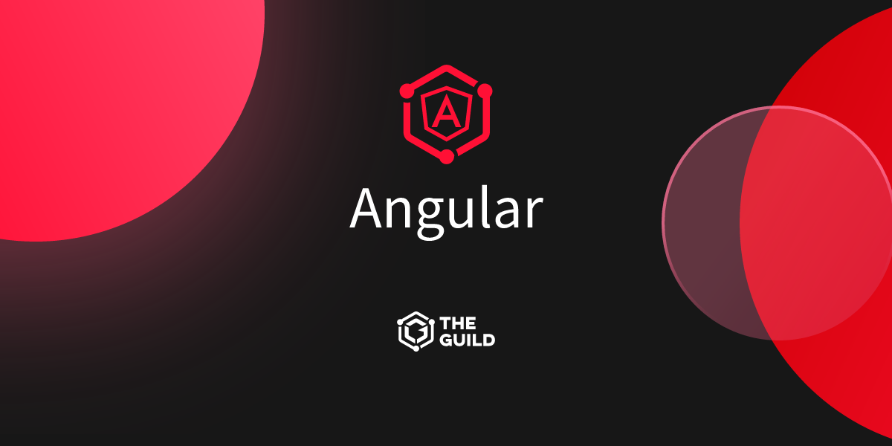</>
  </ShowcaseCard>
  <ShowcaseCard title="KitQL" href="https://1pnk.ru">
    <>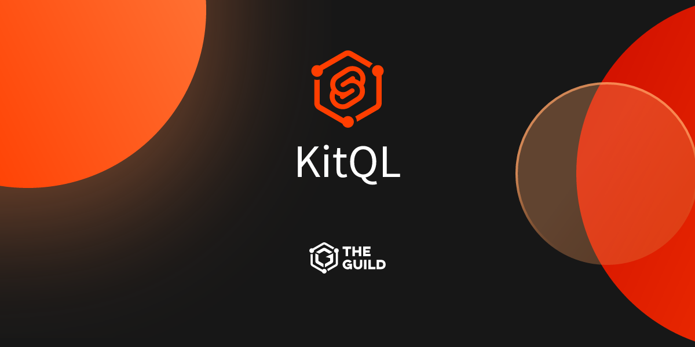</>
  </ShowcaseCard>
  <ShowcaseCard title="GraphQL SSE" href="https://1pnk.ru">
    <>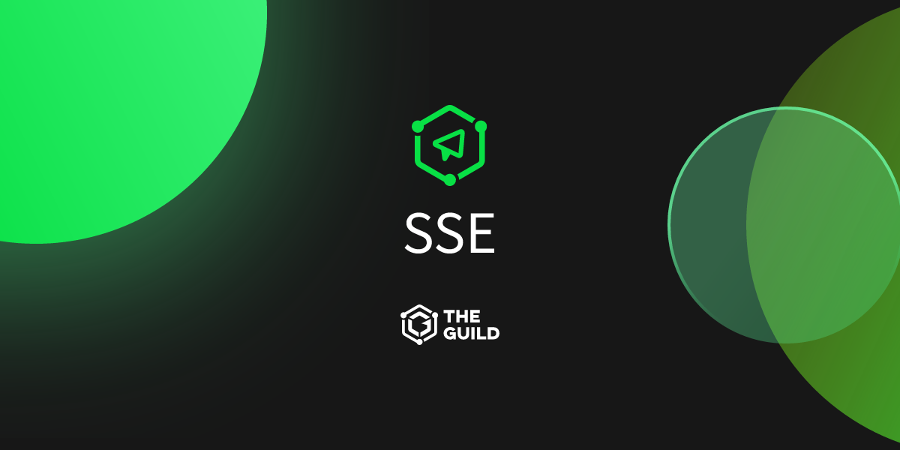</>
  </ShowcaseCard>
  <ShowcaseCard title="GraphQL WS" href="https://1pnk.ru">
    <>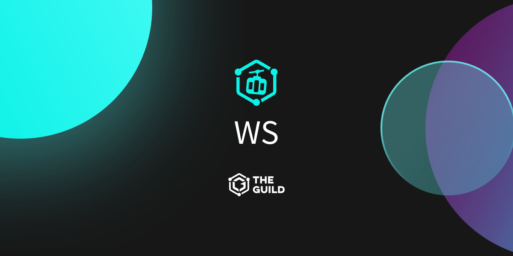</>
  </ShowcaseCard>
  <ShowcaseCard title="feTS" href="https://1pnk.ru">
    <>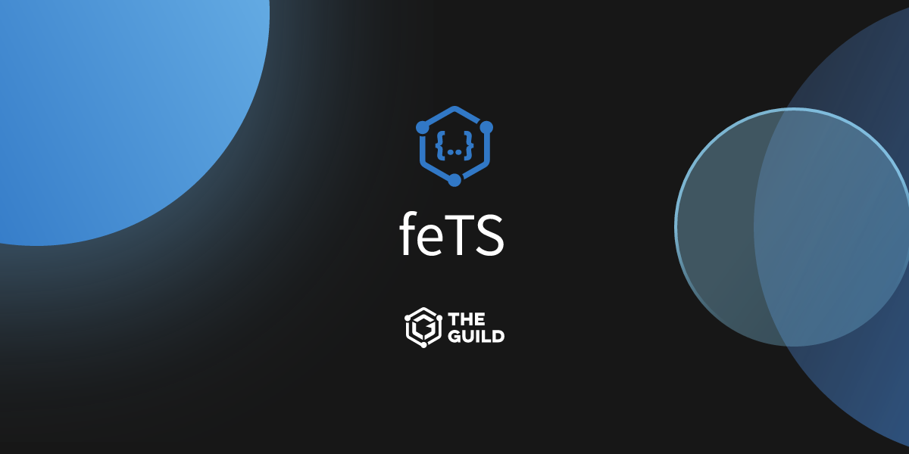</>
  </ShowcaseCard>
</Cards>

export const ShowcaseCard = Object.assign(
  // Copy card component and add default props
  Card.bind(),
  {
    displayName: 'ShowcaseCard',
    defaultProps: {
      image: true,
      arrow: true,
      target: '_blank'
    }
  }
)

